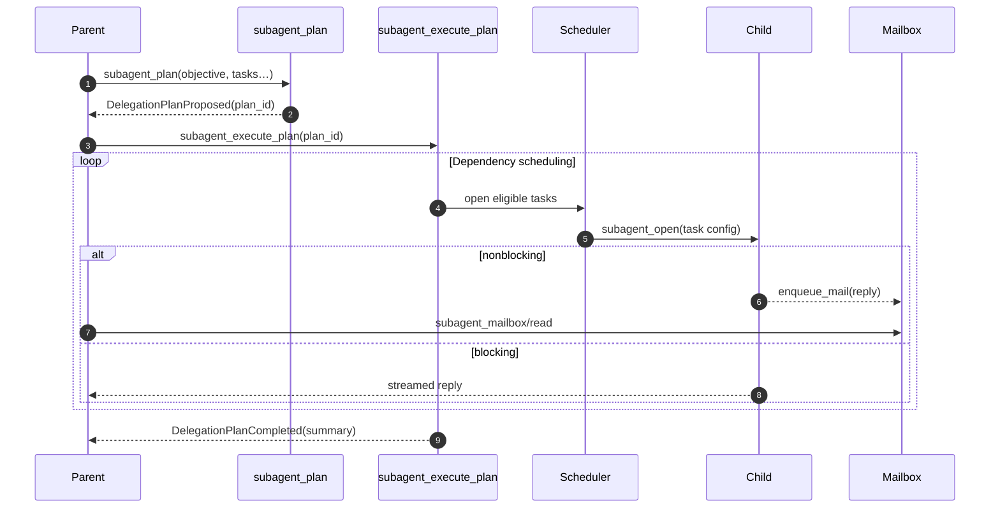
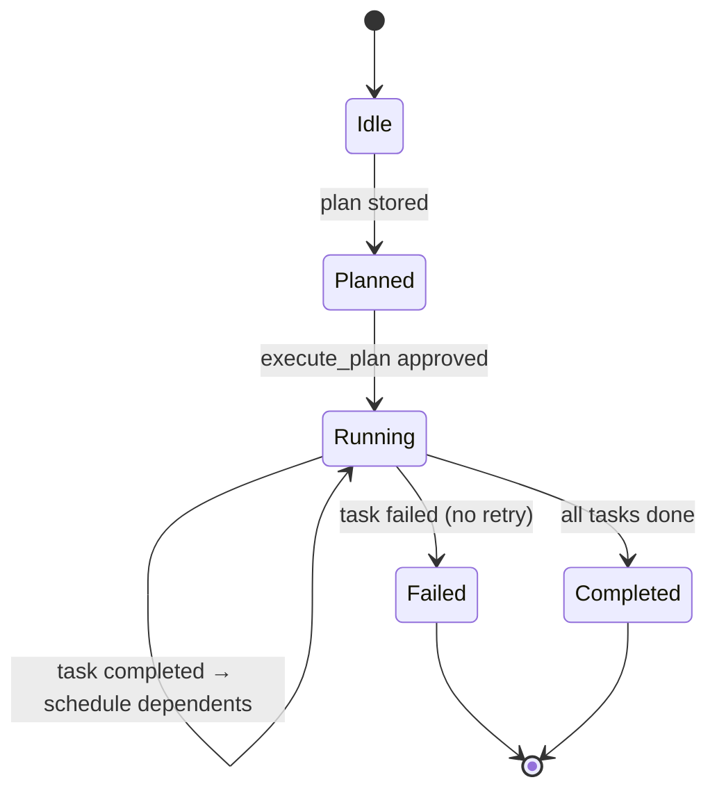

# Subagent Orchestration – Design Proposal

This document proposes a first‑class orchestration layer for planning and executing multi‑subagent work in Codex, informed by how the existing Review mode and Plan tool are implemented today.

- Status: Proposal
- Last updated: 2025‑09‑21

## Background: What Exists Today

- Plan tool (`update_plan`):
  - File: `codex-rs/core/src/plan_tool.rs`
  - Purpose: lets the model record a lightweight checklist. It emits `PlanUpdate` events but does not schedule or execute work.

- Review mode (forked task):
  - File: `codex-rs/core/src/codex.rs` (see `spawn_review_thread`, around lines ~1750–1860)
  - Purpose: launches an isolated review “thread” with its own tools config and user message (review prompt), without leaking into parent history. It uses a dedicated model and signals UI via `EnteredReviewMode`/`ExitedReviewMode`.

- Subagent tool suite:
  - File: `codex-rs/core/src/openai_tools.rs` (definitions), `codex-rs/core/src/codex.rs` (handlers)
  - Tools: `subagent_open`, `subagent_reply` (blocking/nonblocking), `subagent_mailbox`, `subagent_read`, `subagent_end`.
  - Concurrency/depth enforced at runtime (default depth 1; concurrent slots via semaphore).
  - Guidance: child sessions receive `core/subagent_prompt.md` via `user_instructions`.

Gap: There is no “planner” that produces a structured delegation plan (goals, dependencies, boundaries) and then orchestrates subagent creation/execution. The model can improvise using `update_plan` + ad‑hoc `subagent_open` calls, but there is no structured plan capture nor one‑shot execution runner.

## Goals

- Make delegation explicit, reviewable, and replayable.
- Help the model split work into parallelizable tasks with clear boundaries and acceptance criteria.
- Keep orchestration transparent: surface a plan event for UI review; require consent before spawning multiple subagents.
- Preserve existing invariants: base instructions stable; guidance via `user_instructions` for child; adhere to depth/concurrency caps and sandbox policies.

## Proposed API Surface

Introduce two new function tools that work together with the existing suite.

1) `subagent_plan` (capture a structured plan)
- Input schema (draft):
  - `objective`: string – the parent goal in one sentence.
  - `assumptions`: string[] – explicit assumptions/unknowns.
  - `tasks`: array of objects:
    - `id`: string – unique short ID.
    - `goal`: string – narrow, testable.
    - `system_prompt`?: string – optional child role guidance.
    - `cwd`?: string – working directory override.
    - `model`?: string – model override for the child.
    - `mode`: "blocking" | "nonblocking" (default: nonblocking).
    - `max_turns`?: number; `max_runtime_ms`?: number.
    - `dependencies`?: string[] – list of task IDs.
    - `deliverables`: string[] – files/outputs expected.
    - `in_scope`: string[]; `out_of_scope`: string[] – boundary guardrails.
    - `resources`?: string[] – tools/inputs the child expects to use.
    - `risks`?: string[] – known risks or follow‑ups.
  - `concurrency`: number – desired max concurrent subagents (<= runtime cap).

- Output: echoes the normalized plan + `plan_id`.
- Runtime behavior: stores the plan in session state and emits `DelegationPlanProposed(plan)` event.

2) `subagent_execute_plan` (spawn and supervise according to a plan)
- Input schema:
  - `plan_id`?: string – previously captured plan; if omitted, accepts an inline `tasks` array with the same shape as above.
  - `concurrency_override`?: number – optional cap.
  - `confirm`?: boolean – when false, require an explicit approval path.

- Runtime behavior:
  - Validates dependencies, applies concurrency slots, and calls `subagent_open` for ready tasks.
  - For tasks with `mode=nonblocking`, uses the mailbox to collect replies; for `blocking`, streams output inline.
  - Emits progress events: `SubagentTaskStarted/Completed/Failed`, `DelegationPlanProgress`.
  - Final output: aggregated results + mapping from task IDs → `subagent_id`, `mail_id` (if any), token usage.

Notes
- Failure policy: if a task fails, downstream dependents are blocked; emit a progress event and stop execution unless `continue_on_error` is added in the future.
- Security: no broader permissions than existing tools; child `sandbox_mode` may be set per task, but defaults to parent policy.

## Runtime Architecture

- New module: `core/src/subagent_orchestrator.rs` (plan store + executor)
  - Stores `plans: HashMap<PlanId, Plan>` and an index of `TaskId → ExecutionState`.
  - Implements dependency scheduling: tasks whose deps are complete → eligible queue.
  - Binds to session’s concurrency semaphore; respects global `DEFAULT_MAX_SUBAGENT_CONCURRENT`.

- Tool handlers (in `codex.rs`):
  - `subagent_plan`: parse → validate → persist → emit `DelegationPlanProposed` → return `{ plan_id }`.
  - `subagent_execute_plan`: resolve plan → schedule tasks → for each task, build `child_config` and call `open_subagent` (already appends `subagent_prompt.md`); choose blocking/nonblocking path; collect results; emit progress.

- Events (new, for UI/rollouts):
  - `DelegationPlanProposed { plan_id, plan }`
  - `DelegationPlanProgress { plan_id, task_id, status, subagent_id? }`
  - Reuse existing mailbox events for outputs; add a final `DelegationPlanCompleted` summary.

## Interaction Model

Two complementary patterns are supported:

1) Plan‑then‑execute (recommended)
- Model calls `subagent_plan` to propose tasks and boundaries.
- UI/user reviews; if approved, model calls `subagent_execute_plan`.

2) Inline planning (“shim”)
- Model calls `update_plan` (high‑level steps) and then individual `subagent_open` calls.
- Still valid, but lacks structured capture and progress events. The proposed tools provide a better UX and audit trail.

## Mermaid: Planning Flow

## Mermaid: Orchestrator State Machine

## Why not a dedicated “Planner Agent” like Review?

- Review mode isolates context and uses a different model to produce a structured review artifact. For delegation, we need persistent structure and progress tracking across multiple subagent lifecycles, not just a one‑off child turn.
- The proposed tool pair offers a better handshake with the UI (explicit plan proposal + explicit execution) and slots into the existing session/event model.
- If desired later, a `/delegate` Op (akin to `/review`) could wrap a convenience flow that internally invokes `subagent_plan` followed by `subagent_execute_plan` after approval.

## Security & Approvals

- Child permissions inherit from parent unless explicitly narrowed/widened per task. Approval prompts must fire as usual for any escalated commands performed by children.
- The orchestrator never bypasses approval gates; it only sequences tool calls that already respect sandbox/approval policies.

## Testing Strategy

- Unit: plan validation (IDs unique, acyclic deps), scheduler eligibility, concurrency slots, per‑task config derivation, event emission.
- Integration: end‑to‑end with two parallel tasks + one dependent; mailbox collection; graceful failure of a task blocking dependents.
- Snapshot (TUI): rendering of `DelegationPlanProposed` and progress updates (out of scope for this proposal but recommended).

## Backward Compatibility

- No behavior change unless the new tools are enabled. Inline delegation via `subagent_open` remains supported.
- Tools gated by `Config.include_subagent_tool`; the two new functions would be included only when subagents are available.

---

This proposal keeps orchestration minimal yet structured: the model decides “what,” while the runtime safely coordinates “how/when” with clear progress signals and approvals.

