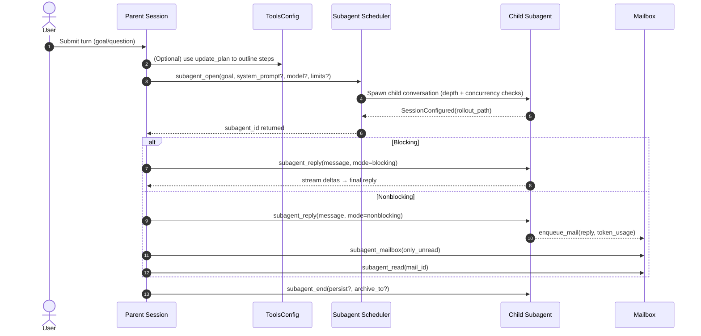

# Subagents Architecture and Flow

This document explains how subagents are modeled and orchestrated in Codex, what planning support exists, and how a parent agent delegates to subagents. It also describes the concurrency/depth limits, mailbox pattern, and where the “plan” tool fits into the flow.

## TL;DR

- There is no dedicated planner component for subagents. Planning is model‑driven using the `update_plan` tool when enabled. The model may outline steps and then call `subagent_open` to spawn focused helpers.
- Subagent lifecycle: `subagent_open` → optional repeated `subagent_reply` (blocking or nonblocking) → `subagent_mailbox`/`subagent_read` for background replies → `subagent_end` to shut down.
- Concurrency and nesting are enforced centrally: max concurrent subagents via a semaphore; default max depth is 1 (nested subagents disabled).
- Child subagents receive subagent‑specific guidance via user_instructions so they behave as scoped helpers.

## Key Components (code references)

- Parent turn context and tool inventory
  - Tools are assembled in `codex-rs/core/src/openai_tools.rs:720` (and nearby): shell/local_shell/exec, `update_plan`, `apply_patch`, `web_search`, `view_image`, and the subagent tools.
  - The subagent tool suite is created in the same file: `subagent_open`, `subagent_reply`, `subagent_mailbox`, `subagent_read`, `subagent_end`.

- Planning tool (optional, model‑driven)
  - Definition and handler: `codex-rs/core/src/plan_tool.rs:15` and `:66`. The tool records a structured plan and emits a `PlanUpdate` event; it does not execute work or orchestrate subagents.
  - GPT‑5 Codex prompt encourages when/how to use planning; see `codex-rs/core/gpt_5_codex_prompt.md:20`.
  - The `subagent_open` tool description itself nudges outlining roles with `update_plan` before spawning multiple subagents (see `openai_tools.rs` around the `system_prompt` parameter).

- Subagent orchestration
  - Entry points (dispatch): `codex-rs/core/src/codex.rs:2673–2973` route `subagent_*` tool calls to the session methods.
  - Opening a subagent: `open_subagent` at `codex-rs/core/src/codex.rs:601`. Applies depth and concurrency checks, configures the child `Config`, and creates a new conversation via `ConversationManager`.
  - Concurrency and depth: `DEFAULT_MAX_SUBAGENT_CONCURRENT` and `DEFAULT_MAX_SUBAGENT_DEPTH` in `codex-rs/core/src/codex.rs:156–163`, enforced with a semaphore and a depth guard (`SubagentDepthReservation`).
  - Nonblocking replies and mailbox: `subagent_reply_blocking` queues background work; replies are captured and enqueued via `enqueue_mail` so the parent can poll with `subagent_mailbox`/`subagent_read`.

- Subagent guidance (scope, dialogue, safety)
  - Guidance text lives in `codex-rs/core/subagent_prompt.md`. It is appended to child sessions’ user_instructions inside `open_subagent` (see `codex-rs/core/src/codex.rs:678–687`). This keeps the base `instructions` stable while ensuring children behave as scoped helpers.

## Is there a “planning agent” for subagents?

Short answer: No dedicated planner process. The “plan” capability is provided as a structured tool (`update_plan`) that the model can use to externalize and update a checklist. The codebase does not include a separate orchestration layer that researches and splits tasks into subagent goals automatically. Instead, the parent model is expected to:

1) Produce/adjust a plan via `update_plan` (optional but encouraged).
2) Decide when to open subagents and with what goals/prompts.
3) Choose blocking vs nonblocking interactions and poll the mailbox when using nonblocking.
4) End subagents when their goal is complete.

This design keeps orchestration inside the model’s reasoning loop and exposes simple primitives for concurrency, isolation, and lifecycle.

## Lifecycle: Parent ↔ Subagent



## Flowchart: Planning to Delegation

```mermaid
flowchart TD
  A[Start Turn] --> B{Plan first?}
  B -- yes --> C[Call update_plan with steps]
  B -- no  --> D[Decide to delegate]
  C --> D
  D --> E[Compose child role: system_prompt? + user_instructions]
  E --> F[subagent_open]
  F --> G{Reply mode}
  G -- blocking --> H[subagent_reply (blocking)<br/>receive final reply]
  G -- nonblocking --> I[subagent_reply (nonblocking)<br/>child runs in background]
  I --> J[enqueue_mail]
  J --> K[subagent_mailbox]
  K --> L[subagent_read<br/>process result]
  H --> M[Next action / End]
  L --> M
  M --> N{subagent still needed?}
  N -- yes --> O[Another subagent_reply]
  N -- no  --> P[subagent_end]
```

## Configuration & Limits

- Enable/disable tools per session: `Config` fields (e.g., `include_plan_tool`, `include_subagent_tool`, `include_view_image_tool`, `tools_web_search_request`) control which tools the model sees.
- Concurrency: `DEFAULT_MAX_SUBAGENT_CONCURRENT` (semaphore) limits how many subagents can run at once.
- Depth: `DEFAULT_MAX_SUBAGENT_DEPTH` limits nested subagents; currently configured to 1 so parent→child only.
- Timeboxing: `max_turns` and `max_runtime_ms` (idle‑based) can be passed to `subagent_open` and enforced by the runner.

## Responsibilities and Boundaries

- Model (parent): planning and orchestration decisions; decides when to split work and how many subagents to spawn.
- Runtime (Codex): enforces safety/limits, spawns/tears down child sessions, provides mailbox and tool surfaces, persists rollout/history.
- Subagent (child): executes a single narrow objective; behaves per `subagent_prompt.md` (scope guardrails, chatty but concise progress, safe operations).

## Extensibility Notes

- A future “planner” could be added as an optional pre‑delegation step that calls `update_plan` internally and then issues a series of `subagent_open` calls. Today, the API surface already supports this pattern; what’s missing is just a dedicated orchestrator module.
- The subagent `system_prompt` parameter can be used by callers to inject role‑specific guidance; currently we default to appending `subagent_prompt.md` via user_instructions.

---

Last updated: 2025‑09‑21
